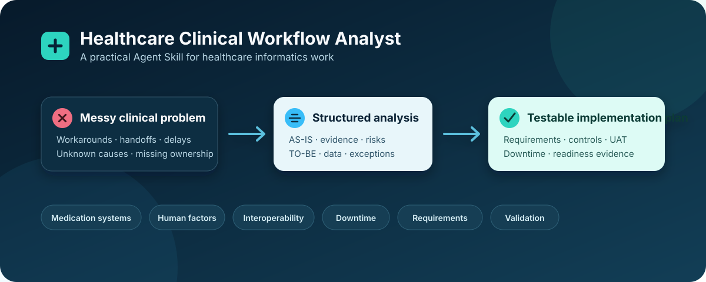

# Healthcare Clinical Workflow Analyst

An open-source Agent Skill for structured, safety-aware analysis of healthcare operations and health IT workflows.



It helps an AI agent examine AS-IS and TO-BE workflows, stakeholder responsibilities, requirements, interoperability, medication technology, downtime, risks, acceptance criteria, and validation without inventing local policy or replacing clinical governance.

Its project and business-analysis discipline is aligned with adaptable PMI and IIBA practices:
understand the need before selecting a solution, engage the right stakeholders, maintain requirement
traceability and change rationale, distinguish verification from acceptance, and evaluate outcomes.
Those practices complement healthcare safety and informatics guidance; they do not replace it.

## Use cases

- EHR and clinical application workflow analysis
- Pharmacy systems and medication-use workflows
- Automated dispensing cabinet implementation or optimization
- Barcode medication administration safety review
- Smart infusion pump workflow and integration analysis
- Interface, data, downtime, go-live readiness, and UAT planning

It is not a clinical decision-support system and must not be used for patient-specific diagnosis, treatment selection, prescribing, or dosing.

## Use it on ChatGPT mobile

This repository is now packaged as a portable, skills-only OpenAI plugin. The plugin must be reviewed and published in OpenAI's universal Plugins Directory before it can be installed in the ChatGPT mobile app.

Current status: **package ready for submission; public mobile installation is not live until OpenAI approves it.**

Publisher steps:

1. Sign in to the [OpenAI plugin submission portal](https://platform.openai.com/apps-manage).
2. Select **Create plugin → Skills only**.
3. Upload the plugin package from this repository.
4. Complete publisher verification, listing details, starter prompts, test cases, availability, and policy attestations.
5. Submit it for OpenAI review.

After approval, users can open the Plugins Directory in ChatGPT mobile, search for **Healthcare Clinical Workflow Analyst**, and install it. No terminal command will be required on mobile.

## Install for local agents

| Product | Fastest setup |
| --- | --- |
| OpenAI Codex or ChatGPT desktop | Run the OpenAI command below |
| Claude Code | Run the Claude command below |
| Claude.ai or Cowork | Use the no-terminal upload steps below |

### OpenAI Codex and ChatGPT desktop

Copy and run this command once:

```bash
npx -y skills add Skharbi/Clinical-workflow-analysis --skill healthcare-clinical-workflow-analyst --global --agent codex --yes
```

Then restart Codex or ChatGPT desktop.

- In Codex, type `$healthcare-clinical-workflow-analyst` or open `/skills`.
- In ChatGPT desktop, open **Skills** in the sidebar and type `@` in a chat to select the skill.

### Claude Code

Copy and run this command once:

```bash
npx -y skills add Skharbi/Clinical-workflow-analysis --skill healthcare-clinical-workflow-analyst --global --agent claude-code --yes
```

Then restart Claude Code. Type `/healthcare-clinical-workflow-analyst` to invoke it, or use `/skills` to confirm that it is installed.

### No terminal: desktop products

1. [Download the ZIP](https://github.com/Skharbi/Clinical-workflow-analysis/archive/refs/heads/main.zip).
2. Extract it. The folder containing `SKILL.md` is the skill folder.
3. Add it to your product:
   - **ChatGPT desktop:** open **Skills** in the sidebar and add the extracted skill folder. Invoke it with `@healthcare-clinical-workflow-analyst`.
   - **Claude.ai or Cowork:** open **Customize → Skills** (or the Skills settings on claude.ai), upload the ZIP, and enable it. Invoke it as `/healthcare-clinical-workflow-analyst` when available.

Standalone OpenAI skills work in ChatGPT desktop, Codex CLI, and the Codex IDE extension. ChatGPT mobile uses the published plugin described above. A skill installed only in Claude Code's local folder is not automatically available in Claude.ai or Cowork; upload and enable it in Claude's Skills settings.

### Manual folder locations

If the installer is unavailable, put the extracted folder here:

| Product | Personal skill folder |
| --- | --- |
| OpenAI Codex | `~/.agents/skills/healthcare-clinical-workflow-analyst/` |
| Claude Code | `~/.claude/skills/healthcare-clinical-workflow-analyst/` |

In both cases, `SKILL.md` must be directly inside that final folder.

### Requirements and updates

The one-command installer requires Node.js and `npx`. The no-terminal route does not.

To choose a different compatible agent interactively:

```bash
npx -y skills add Skharbi/Clinical-workflow-analysis
```

To update later:

```bash
npx skills update
```

Platform references: [OpenAI skills documentation](https://learn.chatgpt.com/docs/build-skills) and [Anthropic skills documentation](https://code.claude.com/docs/en/skills).

## Package structure

- `plugin.json`: portable Agent Plugins manifest for ChatGPT and Codex distribution
- `skills/healthcare-clinical-workflow-analyst/SKILL.md`: activation, method, boundaries, output behavior, and quality checks
- `skills/healthcare-clinical-workflow-analyst/KNOWLEDGE_BASE.md`: core healthcare workflow and informatics domain model
- `skills/healthcare-clinical-workflow-analyst/references/`: focused topic guidance loaded only when relevant
- `skills/healthcare-clinical-workflow-analyst/templates/`: reusable analysis artifacts
- `skills/healthcare-clinical-workflow-analyst/examples/`: realistic demonstrations with explicit assumptions
- `skills/healthcare-clinical-workflow-analyst/evals/`: trigger cases, behavior cases, and scoring rubric
- `tests/validate_package.py`: deterministic package integrity test
- `PRIVACY.md`, `TERMS.md`, and `SUPPORT.md`: public submission policies and support route

## Validate

Run:

```bash
python tests/validate_package.py
```

The package should also pass the platform skill validator before release.

## Release status

Draft RC3 for personal testing. Adds PMI/IIBA-aligned need, value, stakeholder, requirements-life-cycle,
change-control, acceptance, and benefits-evaluation discipline while preserving healthcare safety and
human-governance boundaries. Example outputs are demonstrations, not proof that a live workflow,
system, device, or organization is safe, compliant, or implementation-ready. Structural checks and
limited AI forward tests do not establish v1.0 release readiness.

## License

MIT. See `LICENSE`.
