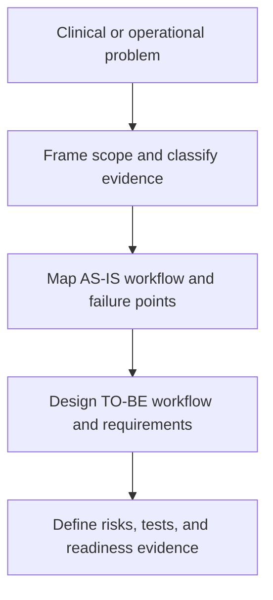
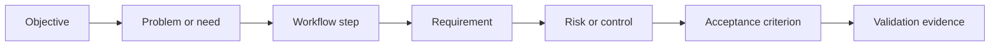

# Healthcare Clinical Workflow Analyst


[](PROJECT_SCOPE.md)
[](tests/validate_package.py)
[](LICENSE)

Healthcare projects rarely fail because nobody drew a flowchart. They fail in the gaps between the flowchart and the real work: an unowned handoff, a workaround nobody documented, a delayed interface message, or a downtime plan that stops at “use paper.”

This Agent Skill helps turn those gaps into a structured analysis that healthcare and technical teams can actually review. It covers the workflow, the people doing the work, the systems and devices involved, the information moving between them, the failure paths, and the evidence needed before implementation.

It is built for clinical informaticists, pharmacy informaticists, healthcare business analysts, application analysts, medication-safety teams, implementation teams, and solution consultants.

## What it does

Give the skill a healthcare workflow problem, stakeholder notes, an implementation idea, or a failed process. It can help you:

- map the real **AS-IS** workflow, including manual work and workarounds;
- design a practical **TO-BE** workflow with exceptions and human verification;
- separate known facts from inference, assumptions, and unknowns;
- identify patient-safety, medication-safety, operational, and human-factors risks;
- define system, device, data, interface, and ownership dependencies;
- write traceable and testable requirements;
- build acceptance criteria, UAT scenarios, and failure-path tests;
- review downtime, restoration, and reconciliation readiness;
- expose blocking questions instead of filling gaps with invented answers.



## Where it helps

| Area | Typical work |
|---|---|
| EHR and clinical applications | Workflow discovery, redesign, upgrades, go-live readiness |
| Pharmacy systems | Verification, preparation, dispensing, inventory, distribution |
| Automated dispensing cabinets | Profiles, overrides, access, replenishment, discrepancies, controlled substances |
| Barcode medication administration | Scan failures, bypass pressure, labels, devices, exceptions, downtime |
| Smart infusion pumps | Association, drug libraries, connectivity, documentation, failure recovery |
| Interoperability and data | Identifiers, mappings, source of truth, errors, retries, reconciliation |
| Testing and implementation | Requirements, acceptance criteria, UAT, negative tests, production validation |
| Downtime and continuity | Detection, communication, fallback, restoration, reconciliation |

## What a useful output looks like

The skill does not produce the same oversized report for every request. A focused question gets a focused artifact. A full assessment can include:

1. problem, objective, scope, and boundaries;
2. evidence, assumptions, and unknowns;
3. AS-IS workflow and stakeholder responsibilities;
4. pain points, failure points, and risks;
5. TO-BE workflow and exception handling;
6. traceable requirements and interface dependencies;
7. downtime and recovery controls;
8. acceptance criteria, test scenarios, and blocking questions.

The traceability chain keeps recommendations tied to the original problem:



## Example prompts

```text
Map our inpatient medication distribution workflow and identify delays,
handoff failures, and questions we must answer before redesign.
```

```text
Create testable requirements and UAT scenarios for an ADC rollout across
four inpatient units. Vendor and interface architecture are not confirmed.
```

```text
Our pharmacy downtime plan says to use paper labels until the system returns.
Review the missing controls, restoration steps, and reconciliation risks.
```

```text
Nurses report bypassing barcode scanning because labels and scanners fail.
Separate the reported causes from verified evidence and propose an investigation.
```

See the complete demonstrations for [ADC implementation](examples/adc-implementation.md), [BCMA safety review](examples/bcma-safety-review.md), and [smart-pump integration](examples/smart-pump-integration.md).

## Install

### Fastest option — ask your agent

Paste this instruction into Codex or another agent that can install Agent Skills from GitHub:

```text
Install the healthcare-clinical-workflow-analyst skill from
https://github.com/Skharbi/Clinical-workflow-analysis
```

Start a new turn or session after installation. The skill can then activate automatically for relevant healthcare workflow requests, or you can invoke it directly:

```text
$healthcare-clinical-workflow-analyst
```

### Terminal — one command

For Codex on macOS or Linux:

```bash
git clone https://github.com/Skharbi/Clinical-workflow-analysis.git "${CODEX_HOME:-$HOME/.codex}/skills/healthcare-clinical-workflow-analyst"
```

For Codex on Windows PowerShell:

```powershell
git clone https://github.com/Skharbi/Clinical-workflow-analysis.git "$HOME\.codex\skills\healthcare-clinical-workflow-analyst"
```

### Any other Agent Skills client

[Download the repository as a ZIP](https://github.com/Skharbi/Clinical-workflow-analysis/archive/refs/heads/main.zip), extract it, rename the folder `healthcare-clinical-workflow-analyst`, and place it in the skills directory documented by your client.

There is no universal skills-directory path across every AI client. The skill files follow the Agent Skills folder pattern, but installation support and folder locations depend on the client being used.

## Repository guide

| Path | Purpose |
|---|---|
| [`SKILL.md`](SKILL.md) | Activation, analysis method, boundaries, and output behavior |
| [`KNOWLEDGE_BASE.md`](KNOWLEDGE_BASE.md) | Core healthcare workflow and informatics principles |
| [`references/`](references/) | Focused guidance loaded only when relevant |
| [`templates/`](templates/) | Reusable workflow, requirements, risk, and readiness artifacts |
| [`examples/`](examples/) | Synthetic demonstrations with explicit assumptions |
| [`evals/`](evals/) | Trigger cases, behavioral cases, and scoring rubric |
| [`PROJECT_SCOPE.md`](PROJECT_SCOPE.md) | Product boundaries and release gates |
| [`SOURCES.md`](SOURCES.md) | Authoritative evidence registry |

## Validate the package

From the repository root:

```bash
python3 tests/validate_package.py
```

The validator checks the required package tree, skill identity, unfinished placeholders, and empty Markdown files. Behavioral quality is evaluated separately using the cases and scoring rubric in [`evals/`](evals/).

## Safety boundary

This is a workflow-analysis skill, not a clinical decision-support system. It must not diagnose a patient, choose treatment, prescribe, calculate a patient-specific dose, set a medical device for a patient, certify compliance, or declare a workflow clinically safe.

Its role is to make risks, assumptions, dependencies, requirements, and validation gaps visible so the appropriate clinical, technical, security, legal, and governance teams can make the decisions.

## Release status

The current release is **Draft RC2**. Structural validation and targeted behavioral tests have passed, but that does not establish clinical validation or operational approval. The project remains pre-v1.0 until its full release gate is completed.

## License

Released under the [MIT License](LICENSE).
